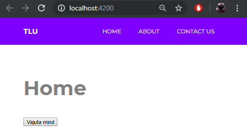

# Angular - Kert Tamm 1.tunnitöö

GITHUB demo link: https://github.com/egertpiksar/Angular

installida kõige viimasem node.js versioon: https://nodejs.org/en/

**npm install -g @angular/cli**

**ng new minuapp**

stylesheetiks sai valitud CSS

tuleb minna vastavasse kausta kuhu angular app sai paigaldatud

**cd minuapp**

**ng serve --open**

kui kõik on õigesti tehtud siis peaks compilimise lõpuks avanema leht automaatselt aadressiga http://localhost:4200/

**NB! enne githubi üleslaadimist lisada .gitignore faili vastavad angular gitignore’d et ei laetaks üles paarsada mb angulari enda faile**
